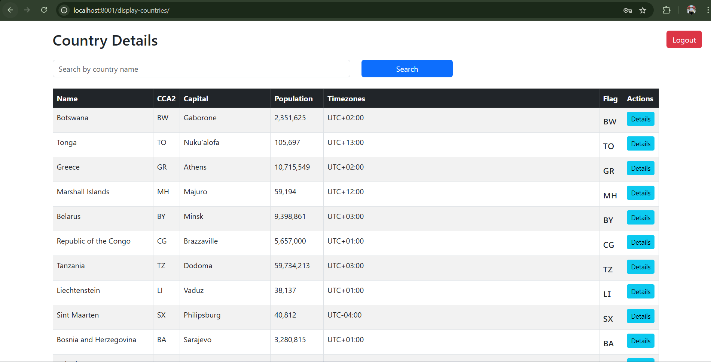

# Country data From restcountry API
This project involves fetching data from an external API, formatting the data, and
 making it available via RESTful APIs. The data display on a simple, secured
 web page where users can find information about different countries.

## Project Description

This Django project interact with restcountry api to get country data and Make API for modification:

- Data Fetching and Storage
- Restrict API access to authenticated users.
- RESTful API Development
- List all countries.
- Retrieve details of a specific country.
- Create a new country entry.
- Update an existing country’s details.
- Delete an existing country.
- List same regional countries of a specific country.
- List countries that speak the same language based on a given language.
- Search for a country by its name (supports partial search).
- Implemented a login page for registered users to access the country list page.
- Used REST API consumption for data display.
- Displayed a table with country details: name, cca2, capital, population, timezone, and flag.
- Included a search field for searching a country by name.
- Implemented a ”Details” button to show same regional countries and spoken languages.
- Used Bootstrap or Bulma for styling.


---

## Setup Instructions

### 1. Clone the Repository

```bash
git clone https://github.com/mdparvex/countries_api.git
cd countries_api
```

### 2. Create a `.env` File
setup .env file with your configurations
```env
#database settings for local
LOCAL_DATABASE_ENGINE=postgresql_psycopg2
LOCAL_DATABASE_NAME=your databse
LOCAL_DATABASE_USERNAME=your username
LOCAL_DATABASE_PASSWORD=your password
LOCAL_DATABASE_HOST=host
LOCAL_DATABASE_PORT=port
# Database Settings for docker
DOCKER = 1 #set 1 if you want to run on docker else 0
DATABASE_ENGINE=postgresql_psycopg2
DATABASE_NAME=database name
DATABASE_USERNAME=user
DATABASE_PASSWORD=dbpassword
DATABASE_HOST=db
DATABASE_PORT=5432

DEBUG = True
DJANGO_CSRF_TRUSTED_ORIGINS = http://localhost:8001
DJANGO_ALLOWED_HOSTS = localhost
DJANGO_LOGLEVEL = info
SECRET_KEY = your secret key
REDIS_LOCATION = 'redis://redis:6379/1'

# Postgres Settings
POSTGRES_DB=dockerdjango
POSTGRES_USER=dbuser
POSTGRES_PASSWORD=dbpassword
```


## Setup locally
Create a virtual environment
```bash
python -m virtualenv <environment_name>
```
Activate the virtual environment
```bash
cd <environment_name>\Scripts
activate
```
install requirements.txt
```bash
pip install -r requirements.txt
```
## Migrate database
Go to the project root directory and run
```bash
python manage.py migrate
```
## Run scripts to save data to local database from restcountry API
Go to the project root directory and run
```bash
python manage.py fetch_save_data_to_database
```
## How to Run the Server
Go to the project root directory and run
```bash
python manage.py runserver
```
## How to Run the Redis Server
Go to the link and download Redis-x64-3.0.504.zip
eg. [click here](https://github.com/microsoftarchive/redis/releases)
unzip the file and redis-server.exe file

## Go to the url
Access it at: http://localhost:8000/

## How to setup in Docker

### Docker Compose Includes:

- `django-web` - FastAPI container
- `db` - PostgreSQL container with volume for persistence
- `redis` - redis server for cache storage

---
### Run with Docker Compose

```bash
docker-compose up --build
```

Then open: http://localhost:8001/

---
## Country data page


## Final Notes
- Ensure PostgreSQL container is reachable with proper `.env` configuration
- Ensure to use a proper database connection for Locan and Docker in `.env` configuration

